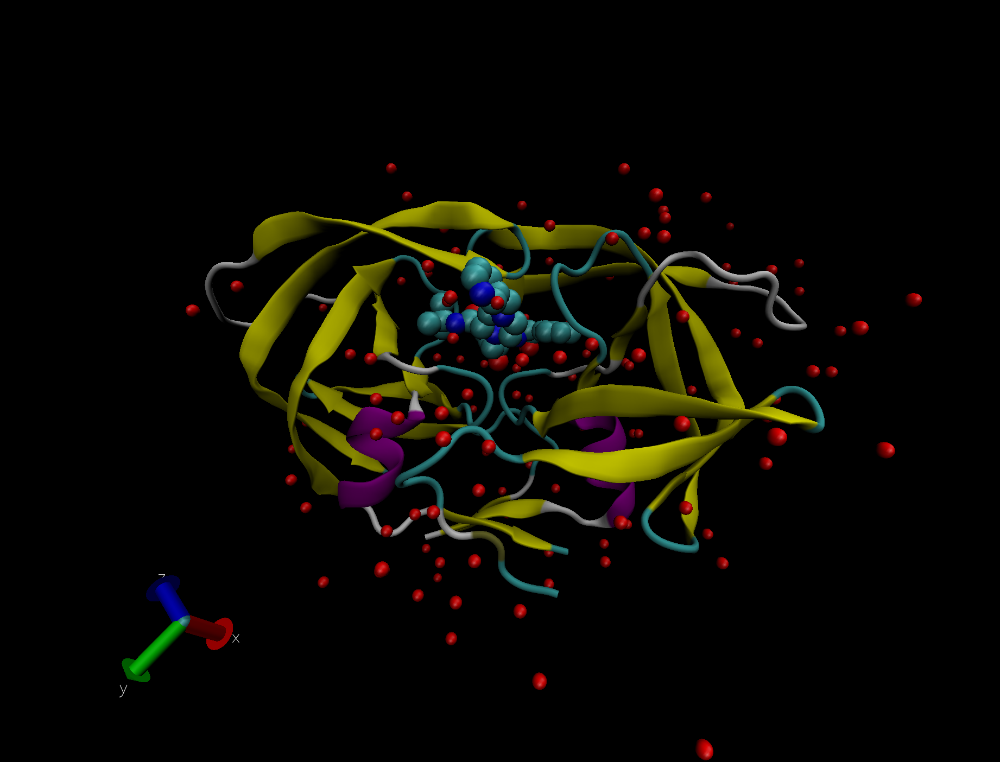
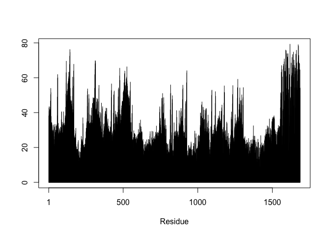

class11
================

# PDB Statistics

``` r
db <-  read.csv("Data Export Summary.csv", row.names =1)
head(db)
```

    ##                          X.ray   NMR   EM Multiple.methods Neutron Other  Total
    ## Protein (only)          142303 11804 5999              177      70    32 160385
    ## Protein/Oligosaccharide   8414    31  979                5       0     0   9429
    ## Protein/NA                7491   274 1986                3       0     0   9754
    ## Nucleic acid (only)       2368  1372   60                8       2     1   3811
    ## Other                      149    31    3                0       0     0    183
    ## Oligosaccharide (only)      11     6    0                1       0     4     22

> **Q1: What percentage of structures in the PDB are solved by X-Ray and
> Electron Microscopy.**

percentage of structures solved by X-ray: 87.6% percentage of structures
solved by EM: 4.9%

``` r
X.ray <- sum(db$X.ray)
EM <- sum(db$EM)
total <-sum(db$Total)
X.ray/total *100
```

    ## [1] 87.55447

``` r
EM/total *100
```

    ## [1] 4.917095

``` r
#more efficient method

method.sums <- colSums(db)
round((method.sums/method.sums["Total"] *100), 2)
```

    ##            X.ray              NMR               EM Multiple.methods 
    ##            87.55             7.36             4.92             0.11 
    ##          Neutron            Other            Total 
    ##             0.04             0.02           100.00

> **Q2: What proportion of structures in the PDB are protein?**

87.36%

``` r
round((db$Total/method.sums["Total"]) *100, 2)
```

    ## [1] 87.36  5.14  5.31  2.08  0.10  0.01

> **Q3: Type HIV in the PDB website search box on the home page and
> determine how many HIV-1 protease structures are in the current PDB?**

When searching Human immunodeficiency virus 1, we get 1828 on the PDB
website.

# Visualizing the HIV-1 protease structure

Displayed all water molecules as red spheres. We can change sphere size
by changing the bond radius.



> **Q4: Water molecules normally have 3 atoms. Why do we see just one
> atom per water molecule in this structure?**

> **Q5: There is a conserved water molecule in the binding site. Can you
> identify this water molecule? What residue number does this water
> molecule have (see note below)?**

# Use Bio3D

``` r
library(bio3d)

pdb <- read.pdb("1hsg.pdb")
pdb
```

    ## 
    ##  Call:  read.pdb(file = "1hsg.pdb")
    ## 
    ##    Total Models#: 1
    ##      Total Atoms#: 1686,  XYZs#: 5058  Chains#: 2  (values: A B)
    ## 
    ##      Protein Atoms#: 1514  (residues/Calpha atoms#: 198)
    ##      Nucleic acid Atoms#: 0  (residues/phosphate atoms#: 0)
    ## 
    ##      Non-protein/nucleic Atoms#: 172  (residues: 128)
    ##      Non-protein/nucleic resid values: [ HOH (127), MK1 (1) ]
    ## 
    ##    Protein sequence:
    ##       PQITLWQRPLVTIKIGGQLKEALLDTGADDTVLEEMSLPGRWKPKMIGGIGGFIKVRQYD
    ##       QILIEICGHKAIGTVLVGPTPVNIIGRNLLTQIGCTLNFPQITLWQRPLVTIKIGGQLKE
    ##       ALLDTGADDTVLEEMSLPGRWKPKMIGGIGGFIKVRQYDQILIEICGHKAIGTVLVGPTP
    ##       VNIIGRNLLTQIGCTLNF
    ## 
    ## + attr: atom, xyz, seqres, helix, sheet,
    ##         calpha, remark, call

``` r
#extract sequence
pdbseq(pdb)
```

    ##   1   2   3   4   5   6   7   8   9  10  11  12  13  14  15  16  17  18  19  20 
    ## "P" "Q" "I" "T" "L" "W" "Q" "R" "P" "L" "V" "T" "I" "K" "I" "G" "G" "Q" "L" "K" 
    ##  21  22  23  24  25  26  27  28  29  30  31  32  33  34  35  36  37  38  39  40 
    ## "E" "A" "L" "L" "D" "T" "G" "A" "D" "D" "T" "V" "L" "E" "E" "M" "S" "L" "P" "G" 
    ##  41  42  43  44  45  46  47  48  49  50  51  52  53  54  55  56  57  58  59  60 
    ## "R" "W" "K" "P" "K" "M" "I" "G" "G" "I" "G" "G" "F" "I" "K" "V" "R" "Q" "Y" "D" 
    ##  61  62  63  64  65  66  67  68  69  70  71  72  73  74  75  76  77  78  79  80 
    ## "Q" "I" "L" "I" "E" "I" "C" "G" "H" "K" "A" "I" "G" "T" "V" "L" "V" "G" "P" "T" 
    ##  81  82  83  84  85  86  87  88  89  90  91  92  93  94  95  96  97  98  99   1 
    ## "P" "V" "N" "I" "I" "G" "R" "N" "L" "L" "T" "Q" "I" "G" "C" "T" "L" "N" "F" "P" 
    ##   2   3   4   5   6   7   8   9  10  11  12  13  14  15  16  17  18  19  20  21 
    ## "Q" "I" "T" "L" "W" "Q" "R" "P" "L" "V" "T" "I" "K" "I" "G" "G" "Q" "L" "K" "E" 
    ##  22  23  24  25  26  27  28  29  30  31  32  33  34  35  36  37  38  39  40  41 
    ## "A" "L" "L" "D" "T" "G" "A" "D" "D" "T" "V" "L" "E" "E" "M" "S" "L" "P" "G" "R" 
    ##  42  43  44  45  46  47  48  49  50  51  52  53  54  55  56  57  58  59  60  61 
    ## "W" "K" "P" "K" "M" "I" "G" "G" "I" "G" "G" "F" "I" "K" "V" "R" "Q" "Y" "D" "Q" 
    ##  62  63  64  65  66  67  68  69  70  71  72  73  74  75  76  77  78  79  80  81 
    ## "I" "L" "I" "E" "I" "C" "G" "H" "K" "A" "I" "G" "T" "V" "L" "V" "G" "P" "T" "P" 
    ##  82  83  84  85  86  87  88  89  90  91  92  93  94  95  96  97  98  99 
    ## "V" "N" "I" "I" "G" "R" "N" "L" "L" "T" "Q" "I" "G" "C" "T" "L" "N" "F"

``` r
#get protein seq 
aa123(pdbseq(pdb))
```

    ##   [1] "PRO" "GLN" "ILE" "THR" "LEU" "TRP" "GLN" "ARG" "PRO" "LEU" "VAL" "THR"
    ##  [13] "ILE" "LYS" "ILE" "GLY" "GLY" "GLN" "LEU" "LYS" "GLU" "ALA" "LEU" "LEU"
    ##  [25] "ASP" "THR" "GLY" "ALA" "ASP" "ASP" "THR" "VAL" "LEU" "GLU" "GLU" "MET"
    ##  [37] "SER" "LEU" "PRO" "GLY" "ARG" "TRP" "LYS" "PRO" "LYS" "MET" "ILE" "GLY"
    ##  [49] "GLY" "ILE" "GLY" "GLY" "PHE" "ILE" "LYS" "VAL" "ARG" "GLN" "TYR" "ASP"
    ##  [61] "GLN" "ILE" "LEU" "ILE" "GLU" "ILE" "CYS" "GLY" "HIS" "LYS" "ALA" "ILE"
    ##  [73] "GLY" "THR" "VAL" "LEU" "VAL" "GLY" "PRO" "THR" "PRO" "VAL" "ASN" "ILE"
    ##  [85] "ILE" "GLY" "ARG" "ASN" "LEU" "LEU" "THR" "GLN" "ILE" "GLY" "CYS" "THR"
    ##  [97] "LEU" "ASN" "PHE" "PRO" "GLN" "ILE" "THR" "LEU" "TRP" "GLN" "ARG" "PRO"
    ## [109] "LEU" "VAL" "THR" "ILE" "LYS" "ILE" "GLY" "GLY" "GLN" "LEU" "LYS" "GLU"
    ## [121] "ALA" "LEU" "LEU" "ASP" "THR" "GLY" "ALA" "ASP" "ASP" "THR" "VAL" "LEU"
    ## [133] "GLU" "GLU" "MET" "SER" "LEU" "PRO" "GLY" "ARG" "TRP" "LYS" "PRO" "LYS"
    ## [145] "MET" "ILE" "GLY" "GLY" "ILE" "GLY" "GLY" "PHE" "ILE" "LYS" "VAL" "ARG"
    ## [157] "GLN" "TYR" "ASP" "GLN" "ILE" "LEU" "ILE" "GLU" "ILE" "CYS" "GLY" "HIS"
    ## [169] "LYS" "ALA" "ILE" "GLY" "THR" "VAL" "LEU" "VAL" "GLY" "PRO" "THR" "PRO"
    ## [181] "VAL" "ASN" "ILE" "ILE" "GLY" "ARG" "ASN" "LEU" "LEU" "THR" "GLN" "ILE"
    ## [193] "GLY" "CYS" "THR" "LEU" "ASN" "PHE"

Let’s plot B-factor

``` r
plot.bio3d(pdb$atom$b, sse = pdb)
```

    ## Warning in plotb3(...): Length of input 'sse' does not equal the length of input
    ## 'x'; Ignoring 'sse'

<!-- -->
