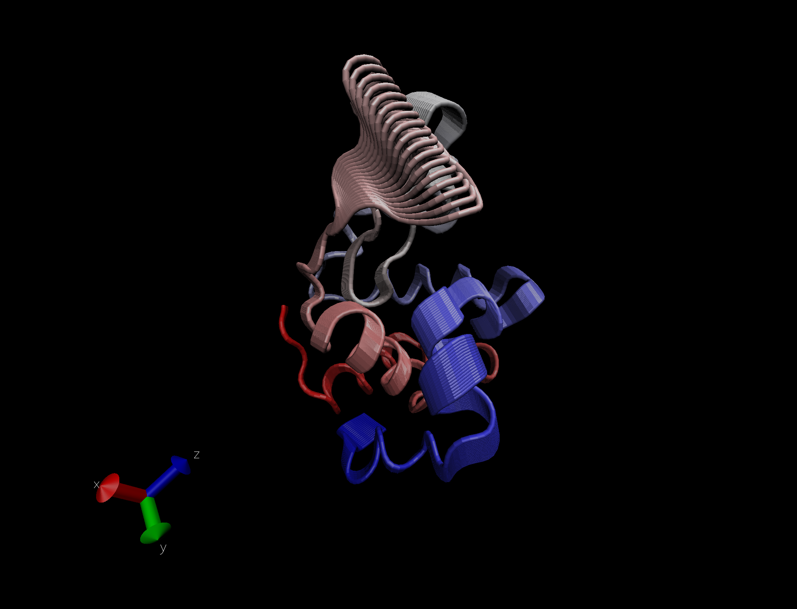
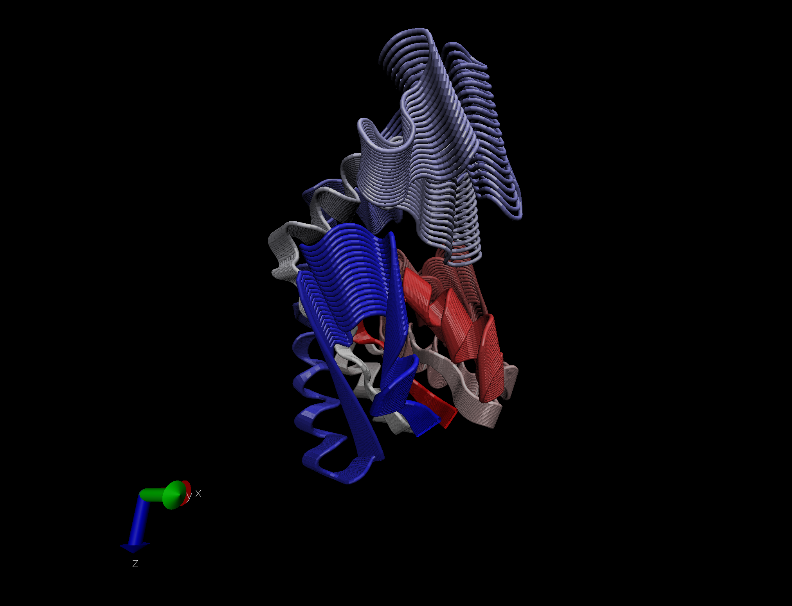

# Comparative analysis of protein structures

Using the bio3D package. 
Note: We used a different file1 (1hel not 1hsg) than in the lab walk-through. 

```{r}
library(bio3d)

pdb <- read.pdb("1hel")
pdb
```
> **Q7: How many amino acid residues are there in this pdb object?**

There are 129 residues. 

> **Q8: Name one of the non-protein residues?**

HOH (185)

> **Q9: How many protein chains are in this structure?**

1 chain 

# Setup 

```{r}
#install.packages("bio3d")
#install.packages("ggplot2")
#install.packages("ggrepel")
#install.packages("devtools")
#install.packages("BiocManager")

#BiocManager::install("msa")
#devtools::install_bitbucket("Grantlab/bio3d-view")
```

> **Q10. Which of the packages above is found only on BioConductor and not CRAN?**

msa 

> **Q11. Which of the above packages is not found on BioConductor or CRAN?**

bio3d-view
found in this line: devtools::install_bitbucket("Grantlab/bio3d-view")

> **Q12. True or False? Functions from the devtools package can be used to install packages from GitHub and BitBucket?*

True 

Let's use bioinformatics method called NMA (Normal Mode Analysis) to predict the dynamics (flexibility) of this enzyme. 

```{r}
modes <- nma(pdb)
plot(modes)


```

Make a "movie" of its predicted motion. We often call this a "trajectory". 

```{r}
mktrj(modes, file="nma.pdb")
```



# Analysis of ADK 

```{r}
library(bio3d)
aa <- get.seq("1ake_A")
aa
#run BLAST from R; may time out so we can use the other command 
# blast <-  blast.pdb(aa)

hits <- NULL
hits$pdb.id <- c('1AKE_A','4X8M_A','6S36_A','6RZE_A','4X8H_A','3HPR_A','1E4V_A','5EJE_A','1E4Y_A','3X2S_A','6HAP_A','6HAM_A','4K46_A','4NP6_A','3GMT_A','4PZL_A')

```

> **Q13. How many amino acids are in this sequence, i.e. how long is this sequence?**

214


```{r}
#hits <- plot(blast)
hits$pdb.id
```

```{r}
#Download related PDB files, commenting out so I don't waste timer rerunning this 
files <-get.pdb(hits$pdb.id, path="pdbs", split = TRUE, gzip = TRUE)
```

Multiple structure alignment 

```{r}
pdbs <- pdbaln(files, fit = TRUE)
```

```{r}
ids <- basename.pdb(pdbs$id)
plot(pdbs, labels=ids)
```

```{r}
library(bio3d.view)
library(rgl)
view.pdbs(pdbs)
```
# PCA 

```{r}
pc.xray <- pca(pdbs)
plot(pc.xray)
```

Make a trajectory visualizaitn of the motion captured by the first PC.

```{r}
#visualize first PC 
pc1 <- mktrj(pc.xray, pc=1, file="pc_1.pdb")
```


