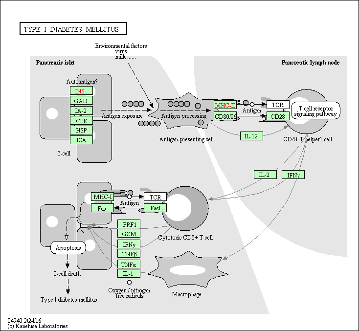

```{r}
library(BiocManager)
```

Background: Our data for today comes from Himes et al. RNASeq analysis of the drud dexamethasone, a synthetic glucocorticoid steroid with anti-inflammatory effecs (Himes et al. 2014).

```{r}
counts <- read.csv("airway_scaledcounts.csv", row.names=1)
metadata <-  read.csv("airway_metadata.csv")
```

Let's have alook at these. 

```{r}
head(counts)
```
```{r}
metadata
```

> Q1. How many genes are in this dataset?

There are 38694 genes in this dataset. 

```{r}
nrow(counts)
```
> Q2. How many ‘control’ cell lines do we have? 

There are 4 control cell lines. 

```{r}
sum(metadata$dex == "control")

```
First I need to extract all the control cell lines. Then I will take the rowwise mean to get the average count vlaues for all genes in these 4 experiments. 
```{r}
control.inds <- metadata$dex == "control"
#pull out control cell lines
control.counts <- counts[, control.inds]
head(control.counts)

control.mean <- rowMeans(control.counts)
```
> Q3. How would you make the above code in either approach more robust?

We made the code above more robust by using the rowMeans rather than manually finding the means by using rowSums/4. This is the better method because it will work even if the data is changed (ex. no longer has 4 control cell lines)

```{r}
treated.inds <- metadata$dex == "treated"
#pull out treated cell lines
treated.counts <- counts[, treated.inds]
head(treated.counts)

treated.mean <- rowMeans(treated.counts)
```

> Q4. Follow the same procedure for the treated samples (i.e. calculate the mean per gene across drug treated samples and assign to a labeled vector called treated.mean)

This is done above.

Now we will combine our meancount data for bookkeeping purposes. 

> Q5 (a). Create a scatter plot showing the mean of the treated samples against the mean of the control samples.

```{r}
meancounts <- data.frame(control.mean, treated.mean)
#make a quick plot
plot (meancounts)
```

> Q5 (b).You could also use the ggplot2 package to make this figure producing the plot below. What geom_?() function would you use for this plot? 

I used geom_point()


```{r}
library(ggplot2)
ggplot(meancounts, aes(x = control.mean, y = treated.mean)) + 
  geom_point()

```
This data strongly indicates that we need a log transformation to better understand our data. 

> Q6. Try plotting both axes on a log scale. What is the argument to plot() that allows you to do this? 

You can do this using log = "xy" as an additional argument in the plot function. 

```{r}
plot(meancounts, log = "xy")
```
Note: You can also do this on ggplot 

```{r}
ggplot(meancounts, aes(x = control.mean, y = treated.mean)) + 
  geom_point() + 
  scale_x_continuous(trans="log2") + 
  scale_y_continuous(trans="log2")
```

We often use log2 in this field because it has nice mathematical properties that make interpretations easier. 

```{r}
log2(40/10)
log2(5/10)

```

We see 0 values for no change, positive values for increases, and negative values for decreases. this nice property leads us to work with **log2(fold-change)** all the time in the genomics and proteomics field. 

Let's add the **log2(fold-change)** values to our meancounts dataframe. 

```{r}
meancounts$log2fc <- log2(meancounts[,"treated.mean"]/meancounts[,"control.mean"])
head(meancounts)
```
I need to exlude the genes (ie rows) with zero counts because we cant say anything about these (dont have data for them). 

```{r}
head(meancounts[,1:2] == 0)

```
I can use the **which()** function with the `arr.ind=TRUE` argument to get the columns and rows where the TRUE values are (the zero counts in our case).

```{r}
zero.vals <- which(meancounts[,1:2] == 0, arr.ind = TRUE)
head(zero.vals)
to.rm <- unique(zero.vals[, "row"])
#commenting out to make the pdf shorter
#sort(to.rm)
```
Now, we have to remove these from our `meancounts` dataframe. Leaving us with 21817 genes/rows. 
```{r}
mycounts <- meancounts[-to.rm,]
head(mycounts)
nrow(mycounts)
```
> Q7. What is the purpose of the arr.ind argument in the which() function call above? Why would we then take the first column of the output and need to call the unique() function?

The arr.ind=TRUE argument makes which() return both the row and column indices (i.e. positions) where there are TRUE values. In this case this will tell us which genes (rows) and samples (columns) have zero counts. 

```{r}
up.ind <- mycounts$log2fc > 2
sum(up.ind)
down.ind <- mycounts$log2fc < (-2)
sum(down.ind)
```

> Q8. Using the up.ind vector above can you determine how many up regulated genes we have at the greater than 2 fc level? 

250 genes


> Q9. Using the down.ind vector above can you determine how many down regulated genes we have at the greater than 2 fc level? 

367 genes

> Q10. Do you trust these results? Why or why not?

Not yet, our results are not statistically significant. Fold change can be large (e.g. >>two-fold up- or down-regulation) without being statistically significant. We should determine statistical significance before determining a conclusion. 

# DESeq2

Let’s do this the right way. DESeq2 is an R package specifically for analyzing count-based NGS data like RNA-seq. It is available from Bioconductor. 

```{r}
library(DESeq2)

```

We need to first setup the input data. 
```{r}
dds <- DESeqDataSetFromMatrix(countData=counts, 
                              colData=metadata, 
                              design=~dex)
dds
```

Now we can run DESeq analysis. 

```{r}
#This object has a place to put results in it. So we can assign it like this. 
dds <- DESeq(dds)
```

To get the results here we use the deseq `results()` function: 

```{r}
res <- results(dds)
head(res)
```
Lets set out pvalue cutoff to 0.05 instead of the default 0.1. 
```{r}
res05 <- results(dds, alpha=0.05)
summary(res05)
```


# Adding annotation data 

```{r}
#BiocManager::install("AnnotationDbi")
#BiocManager::install("org.Hs.eg.db")
library("AnnotationDbi")
library("org.Hs.eg.db")
columns(org.Hs.eg.db)
res$symbol <- mapIds(org.Hs.eg.db,
                     keys=row.names(res), # Our genenames
                     keytype="ENSEMBL",        # The format of our genenames
                     column="SYMBOL",          # The new format we want to add
                     multiVals="first")
head(res)
```
> Q11. Run the mapIds() function two more times to add the Entrez ID and UniProt accession and GENENAME as new columns called res$entrez, res$uniprot and res$genename.

```{r}
res$entrez <- mapIds(org.Hs.eg.db,
                     keys=row.names(res),
                     column="ENTREZID",
                     keytype="ENSEMBL",
                     multiVals="first")

res$uniprot <- mapIds(org.Hs.eg.db,
                     keys=row.names(res),
                     column="UNIPROT",
                     keytype="ENSEMBL",
                     multiVals="first")

res$genename <- mapIds(org.Hs.eg.db,
                     keys=row.names(res),
                     column="GENENAME",
                     keytype="ENSEMBL",
                     multiVals="first")

head(res)
```

```{r}
ord <- order( res$padj )
#View(res[ord,])
head(res[ord,])
write.csv(res[ord,], "deseq_results.csv")
```

# Data Visualization 

Let’s make a commonly produced visualization from this data, namely a so-called Volcano plot. These summary figures are frequently used to highlight the proportion of genes that are both significantly regulated and display a high fold change.


```{r}
# Setup our custom point color vector 
mycols <- rep("gray", nrow(res))
mycols[ abs(res$log2FoldChange) > 2 ]  <- "red" 

inds <- (res$padj < 0.01) & (abs(res$log2FoldChange) > 2 )
mycols[ inds ] <- "blue"

# Volcano plot with custom colors 
plot( res$log2FoldChange,  -log(res$padj), 
 col=mycols, ylab="-Log(P-value)", xlab="Log2(FoldChange)" )

# Cut-off lines
abline(v=c(-2,2), col="gray", lty=2)
abline(h=-log(0.1), col="gray", lty=2)
```

Let's use the EnhancedVolcano package. 

#BiocManager::install("EnhancedVolcano")
library(EnhancedVolcano)
x <- as.data.frame(res)

EnhancedVolcano(x,
    lab = x$symbol,
    x = 'log2FoldChange',
    y = 'pvalue')
    
# Patway analysis with R and Bioconductor


```{r}
#BiocManager::install( c("pathview", "gage", "gageData") )
library(pathview)
library(gage)
library(gageData)

data(kegg.sets.hs)

head(kegg.sets.hs, 2)

```


```{r}
foldchanges = res$log2FoldChange
names(foldchanges) = res$entrez
head(foldchanges)
# Get the results
keggres = gage(foldchanges, gsets=kegg.sets.hs)
```

```{r}
attributes(keggres)
# Look at the first three down (less) pathways
head(keggres$less, 3)
pathview(gene.data=foldchanges, pathway.id="hsa05310")

# A different PDF based output of the same data
pathview(gene.data=foldchanges, pathway.id="hsa05310", kegg.native=FALSE)
```


> Q12. Can you do the same procedure as above to plot the pathview figures for the top 2 down-reguled pathways?

```{r}
pathview(gene.data=foldchanges, pathway.id="hsa05332")
pathview(gene.data=foldchanges, pathway.id="hsa04940")

```





